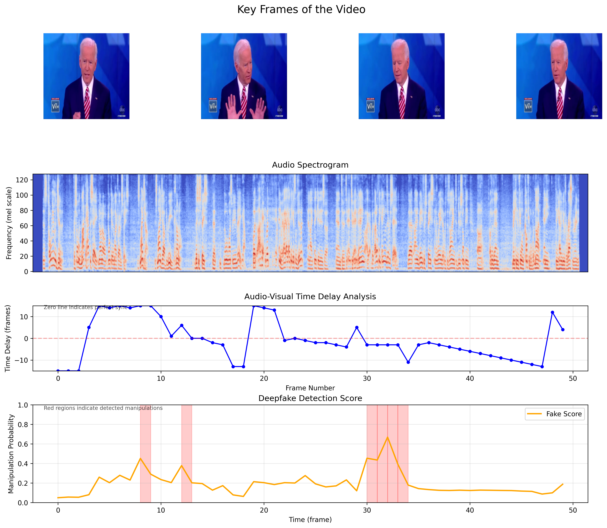

# Deep Fake Detection

Self-Supervised Audiovisual Deepfake Detection on the Presidential Deepfakes Dataset (PDD)

## Overview

This project implements a cutting-edge deepfake detection system that identifies manipulated videos by analyzing inconsistencies between audio and visual streams. The approach uses self-supervised learning, requiring no labeled training data and enabling robust anomaly detection.

## Features

- **Self-Supervised Learning:** No labeled data required for training.
- **Audio-Visual Synchronization Analysis:** Exploits temporal inconsistencies in deepfake videos.
- **Flexible Architectures:** Supports multiple state-of-the-art backbones:
  - **Visual Encoders:** ResNet-18 2D+3D, Vision Transformer (ViT)
  - **Audio Encoders:** VGG-M, Wav2Vec 2.0
  - **Fusion Module:** Transformer-based architecture for cross-modal feature integration.
- **Pretrained Model Support:** Includes pretrained weights for faster experimentation.
- **Easy Deployment:** Modular implementation for training, inference, and dataset processing.

## Installation

1. Clone the repository:
   ```bash
   git clone https://github.com/Xuening0322/deep-fake-detection.git
   cd deep-fake-detection
   ```

2. Install dependencies:
   ```bash
   pip install -r requirements.txt
   ```

3. Download datasets:
   - **LRS2 Dataset:** Use the provided `download_lrs2.py` script.
   - **Presidential Deepfakes Dataset (PDD):** Use the `download_pdd.py` script (requires `yt_dlp`).

4. Download pretrained model weights:
   [Google Drive Link](https://drive.google.com/file/d/1-RGElrYZquO6RGE9Xjf-ODkb6UXWBR3g/view?usp=sharing)

## Project Structure

```
deep-fake-detection/
├── backbone/           # Backbone model architectures
├── checkpoints/        # Pretrained model checkpoints
├── audio_process.py    # Audio preprocessing utilities
├── model.py            # Main model implementation
├── detect.py           # Deepfake detection script
├── train.py            # Training script
├── config_deepfake.py  # Configuration file
├── download_lrs2.py    # LRS2 dataset download script
├── download_pdd.py     # PDD dataset download script
├── requirements.txt    # Python dependencies
└── README.md           # Documentation
```

## Datasets

### LRS2 Dataset
The **Lip Reading Sentences 2 (LRS2)** dataset contains 97,000 speech videos of cropped face tracks. Download it using the provided script:
```bash
python download_lrs2.py --username your_user_name \
                       --password your_password \
                       --output_dir /path/to/output_directory
```

### Presidential Deepfakes Dataset (PDD)
To download the PDD dataset:
1. Install `yt_dlp`:
   ```bash
   pip install yt_dlp
   ```
2. Run the script:
   ```bash
   python download_pdd.py
   ```

## Usage


### Training

1. Ensure all datasets are downloaded.
2. Run the training script:
   ```bash
   python train.py \
       --train_list /path/to/train_list.txt \
       --device cuda:0 \
       --output_dir ./checkpoints \
       --lr 1e-4 \
       --epochs_0 30 \
       --epochs_1 30
   ```

### Inference

#### Single Video
```bash
python detect.py \
    --test_video_path test.mp4 \
    --device cuda:0 \
    --output_dir out/
```

You can view the generated visualizations in `out/`.




#### Dataset Inference
```bash
python detect.py \
    --test_video_path /path/to/fake_videos.txt \
    --device cuda:0 \
    --output_dir out/
```


## Acknowledgments

This project's implementation is largely adopted from Feng, Chao, et al. "Self-supervised video forensics by audio-visual anomaly detection." CVPR, 2023.

```bibtex
@inproceedings{feng2023self,
  title={Self-supervised video forensics by audio-visual anomaly detection},
  author={Feng, Chao and Chen, Ziyang and Owens, Andrew},
  booktitle={Proceedings of the IEEE/CVF Conference on Computer Vision and Pattern Recognition},
  pages={10491--10503},
  year={2023}
}